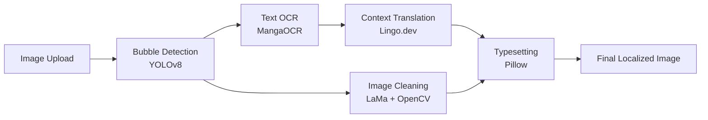

# MangaScribe

MangaScribe is an AI-powered manga and manhwa scanlation pipeline. It seamlessly handles speech bubble detection, optical character recognition (OCR), context-aware translation, image inpainting (cleaning), and text typesetting. 

## MangaScribe v1 (Legacy CLI)

The original version of MangaScribe was built as a pure Python Command Line Interface (CLI) application. Its primary goal was to automate the tedious process of manga translation using entirely local models.

### Key Features of v1:
*   **Local Processing:** Relied heavily on local models like YOLOv8 for bubble detection and MangaOCR for text extraction.
*   **Generic Translation:** Used local LLMs (via Ollama) for basic translation, which often resulted in flat or literal interpretations.
*   **Automated Inpainting:** Integrated Simple LaMa and OpenCV to remove original Japanese text from the art.
*   **Basic Typesetting:** Rendered the translated English text back into the speech bubbles using Pillow.
*   **CLI Interface:** Users interacted with the pipeline step-by-step or entirely automatically via terminal commands.

---

## MangaScribe v2 (Current)

MangaScribe v2 completely overhauls the architecture into a full-stack web application, bringing professional-grade localization tools and a stunning graphic interface directly to the user's browser.

### What We Built in v2:
*   **Full-Stack Architecture:** Transitioned from a standalone script to a robust FastAPI Python backend and a modern Next.js React frontend.
*   **Web Translation Studio:** A dedicated web dashboard allowing users to drag and drop manga or manhwa pages, view detected bubbles interactively, and process them in real-time.
*   **Lingo.dev Integration:** Replaced the generic local translation with the Lingo.dev SDK. This enables context-aware translations utilizing MCP-style prompts to preserve character tone, emotional intensity, and series specific terminology.
*   **Native Localization Support:** Added dedicated support for both English and Hindi, demonstrating the ability to craft powerful, native-sounding localizations rather than direct literal translations.
*   **Narration Engine:** Integrated the Web Speech API to synthetically narrate the translated text while synchronously highlighting the active speech bubbles.
*   **Retro Pop-Art UI:** Implemented a highly stylized, dark-mode retro comic aesthetic featuring thick borders, screentone background patterns, and vibrant accent colors (cherry red, golden yellow, vintage teal).
*   **Automated End-to-End Rendering:** Users can click a single button to apply translations, clean the art, typeset the new language, and automatically download the finished localized image.

### Pipeline Architecture



## Getting Started

### Prerequisites
*   Python 3.10+
*   Node.js 18+
*   Lingo.dev API Key (For context-aware translation)

### Installation

1.  **Clone the Repository**
    ```bash
    git clone https://github.com/Aditya-54/Manga-Manhwa-Scripte-page-Translation.git
    cd Manga-Manhwa-Scripte-page-Translation
    ```

2.  **Backend Setup**
    ```bash
    pip install -r requirements.txt
    python download_model.py
    cp .env.example .env
    ```
    *Add your LINGODOTDEV_API_KEY to the `.env` file.*

3.  **Frontend Setup**
    ```bash
    cd web
    npm install
    cp .env.example .env.local
    ```
    *Add your LINGODOTDEV_API_KEY to `.env.local`.*

### Running the Application

Start the backend and frontend servers in separate terminal instances:

**Terminal 1 (Backend):**
```bash
python api_server.py
```

**Terminal 2 (Frontend):**
```bash
cd web
npm run dev
```

Navigate to `http://localhost:3000` in your web browser to open the Translation Studio.

## Technology Stack

*   **Detection:** YOLOv8 (comic-speech-bubble-detector)
*   **OCR:** MangaOCR
*   **Translation:** Lingo.dev SDK
*   **Cleaning:** Simple LaMa Inpainting + OpenCV
*   **Typesetting:** Pillow
*   **Backend:** FastAPI + Uvicorn
*   **Frontend:** Next.js 16 + TypeScript + Tailwind CSS 4

## Contributing

Contributions to improve the pipeline, add new language support, or enhance the web UI are immensely welcome. Please open an issue or submit a pull request for review.
