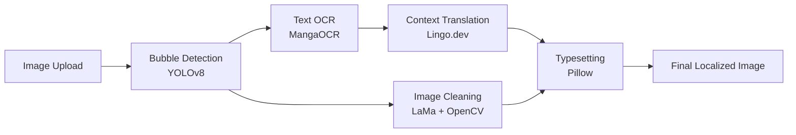

<div align="center">
  <h1>MangaScribe</h1>
  <p>
    <b>State-of-the-Art (SOTA) Context-Aware Manga & Manhwa Localization Pipeline</b>
  </p>
  <p>
    <a href="https://github.com/Aditya-54/Manga-Manhwa-Scripte-page-Translation"></a>
    <a href="https://nextjs.org"></a>
    <a href="https://fastapi.tiangolo.com"></a>
    <a href="https://lingo.dev"></a>
  </p>
</div>

MangaScribe is a high-performance computer vision and AI translation pipeline developed for high-quality manga and manhwa scanlation. It incorporates YOLOv8 object detection, advanced Optical Character Recognition (OCR), LaMa neural inpainting, and Lingo.dev context-aware AI translation to deliver unparalleled localization natively into English and Hindi.

---


### Performance & Feature Comparison

| Capability | MangaScribe v1 | MangaScribe v2 (Current) |
|---|---|---|
| **Architecture** | Python CLI Script | Full-Stack Web App (Next.js + FastAPI) |
| **User Interface** | Terminal Commands | Interactive Web Studio (Drag & Drop) |
| **Translation Engine** | Local Fallback (Ollama) | Lingo.dev Context-Aware AI Engine |
| **Localization Quality** | Generic & Literal | Native English & Hindi (Emotion Preserved) |
| **Aesthetics** | N/A | Retro Pop-Art Comic Themed UI |
| **Accessibility** | None | Real-time Web Speech Narration |
| **Workflow** | Manual File Management | Automated End-to-End Image Download |

---

## Why MangaScribe?

MangaScribe prioritizes real-world automation, character voice preservation, and accessibility. Unlike generic AI translators that strip the emotion and tone from characters, MangaScribe leverages Lingo.dev's MCP-style prompts to guarantee that an aggressive villain sounds menacing and a comedic sidekick sounds hilarious.

### Core Technologies

* **YOLOv8-based Detection:** Identifies speech bubbles across varied manga and manhwa panel layouts with near-perfect accuracy.
* **MangaOCR Integration:** Specialized optical character recognition robust against vertical, horizontal, and stylized Japanese/Korean text.
* **Contextual Localization:** Translates semantic meaning, tone, and genre-specific nuances.
* **Smart Inpainting:** Uses Simple LaMa + OpenCV to cleanly erase source text while perfectly preserving background artwork and complex screentones.
* **Auto-Typesetting:** Automatically word-wraps, centers, and outlines the localized text back into the original bubbles using Pillow.

---

## Pipeline Architecture

Our modular inference and localization pipeline ensures maximum scalability and transparency at every step:



---

## Quickstart Installation

We provide pre-configured setups for both the backend processing engine and the frontend web studio.

### Prerequisites
* Python 3.10+
* Node.js 18+
* [Lingo.dev API Key](https://lingo.dev) (Required for context-aware translation)

### Step 1: Clone the Repository
```bash
git clone https://github.com/Aditya-54/Manga-Manhwa-Scripte-page-Translation.git
cd Manga-Manhwa-Scripte-page-Translation
```

### Step 2: Backend Configuration
Initialize the PyTorch framework, install dependencies, and download the YOLO weights:
```bash
pip install -r requirements.txt
python download_model.py
cp .env.example .env
```
*Note: Ensure your LINGODOTDEV_API_KEY is added to the `.env` file.*

### Step 3: Frontend Configuration
Initialize the Next.js visual dashboard:
```bash
cd web
npm install
cp .env.example .env.local
```
*Note: Ensure your LINGODOTDEV_API_KEY is added to the `.env.local` file.*

---

## Usage

Use MangaScribe via the interactive web studio for real-time visualization, editing, and automated processing.

**Start the Inference Backend (Terminal 1):**
```bash
python api_server.py
```

**Start the Web Studio (Terminal 2):**
```bash
cd web
npm run dev
```

Navigate to `http://localhost:3000` to launch the Translation Studio. Upload an image, select your target language (English or Hindi), specify a context prompt, and let the pipeline run.

---

## License & Contribution

MangaScribe is open-source software. Contributions are actively encouraged. If you encounter bugs, have feature requests, or wish to contribute to the core pipeline, please open an Issue or submit a Pull Request.

To contribute:
1. Fork the repository
2. Create your feature branch (`git checkout -b feature/AmazingFeature`)
3. Commit your changes (`git commit -m 'Add some AmazingFeature'`)
4. Push to the branch (`git push origin feature/AmazingFeature`)
5. Open a Pull Request
```
